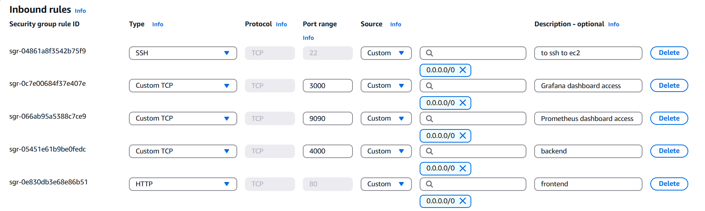

# 🧑‍💻 MERNDevOps

A modern, production-ready MERN stack application with robust **CI/CD**, **Docker-based containerization**, **real-time monitoring**, and **cloud deployment** using **AWS EC2**.

> 🚀 Designed for speed, reliability, and visibility using best DevOps practices.

---

## 📌 Features

✅ Full-stack MERN application  
✅ Dockerized using multi-container setup (client, server, MongoDB, NGINX)  
✅ GitHub Actions CI/CD pipeline  
✅ Deployed on AWS EC2 with SSH automation  
✅ Monitoring using Prometheus, Grafana, and AWS CloudWatch  
✅ Custom network, reverse proxy, auto-restart, and logging configured

---

## 🖼️ Screenshots

| Landing Page | Grafana Dashboard | Terminal Logs |
|--------------|-------------------|----------------|
|  |  |  |

> 🔍 Place your actual screenshots in a `screenshots/` folder.

---

## 🗂 Project Structure

mern-devops/
├── client/ # React frontend
│ ├── Dockerfile
│ └── ...
├── server/ # Node.js + Express backend
│ ├── Dockerfile
│ └── ...
├── monitoring/ # Prometheus + Grafana config
│ ├── prometheus.yml
│ └── grafana/
├── nginx/ # NGINX reverse proxy config
│ └── default.conf
├── docker-compose.yml # Multi-container definition
├── .github/workflows/ # GitHub Actions CI/CD pipeline
├── .env # Environment variables
└── README.md

yaml
Copy
Edit

---

## ⚙️ Run the App Locally (Dockerized)

```bash
# 1. Clone the repository
git clone https://github.com/yourusername/mern-devops.git
cd mern-devops

# 2. Create a .env file (sample provided as .env.example)

# 3. Build and start the application
docker-compose up --build

# 4. Visit:
# Frontend:     http://localhost:3000
# Backend API:  http://localhost:5000/api
# Mongo UI:     http://localhost:8081 (if enabled)
# Grafana:      http://localhost:3001 (login: admin/admin)
⚙️ CI/CD Pipeline with GitHub Actions
yaml
Copy
Edit
# .github/workflows/deploy.yml

name: CI/CD Pipeline

on:
  push:
    branches: [ main ]

jobs:
  deploy:
    runs-on: ubuntu-latest
    steps:
      - uses: actions/checkout@v3

      - name: Set up Docker Buildx
        uses: docker/setup-buildx-action@v2

      - name: Build Docker Images
        run: docker-compose -f docker-compose.prod.yml build

      - name: Deploy to AWS EC2 via SSH
        uses: appleboy/ssh-action@v1
        with:
          host: ${{ secrets.EC2_HOST }}
          username: ${{ secrets.EC2_USER }}
          key: ${{ secrets.EC2_SSH_KEY }}
          script: |
            cd ~/mern-devops
            git pull origin main
            docker-compose -f docker-compose.prod.yml down
            docker-compose -f docker-compose.prod.yml up -d --build
✅ This pipeline builds, tests, and deploys your app on every push to main.

📊 Monitoring Setup
🔧 Prometheus
Prometheus is configured to scrape metrics from Node.js, MongoDB, and Docker.

Target endpoints:

/metrics from the backend server

Docker Engine metrics

Node Exporter for EC2 instance

📈 Grafana
Visualize metrics like:

CPU usage

Network traffic

Request latency

MongoDB connections

Dashboards available at http://<ec2-ip>:3001

Credentials: admin / admin

☁️ AWS CloudWatch
EC2 instance monitored via CloudWatch for:

Disk & memory usage

Logs and events

Uptime & network statistics

📡 Deployment Architecture
java
Copy
Edit
Client (React)
   ↓
NGINX (Reverse Proxy)
   ↓
Express API (Node.js)
   ↔ MongoDB (Docker Volume)
   ↓
AWS EC2 (Ubuntu)
   ↑
CI/CD: GitHub Actions
   ↑
Monitoring: Prometheus + Grafana
📈 Performance Metrics
🚀 CI/CD Runtime: ~49 seconds

⚙️ CPU Usage: ~9.98% average during load

📉 Manual Deployment Effort: Reduced by 100%

🔍 100% Uptime with automatic container restart on crash

📑 License
This project is licensed under the MIT License.

👨‍💻 Author
Aman Agrawal
📍 3rd Year | IIIT Bhopal
💻 Full Stack Developer & DevOps Enthusiast
🔗 LinkedIn
🔗 GitHub

Star 🌟 this repository if you find it useful!

python
Copy
Edit
